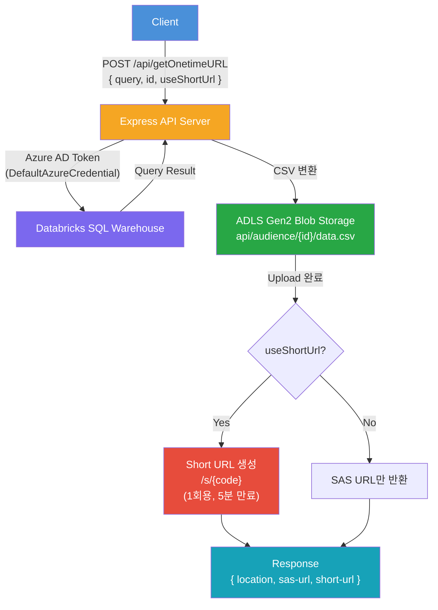
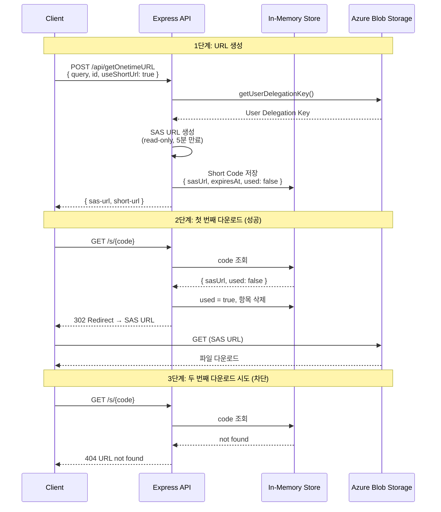
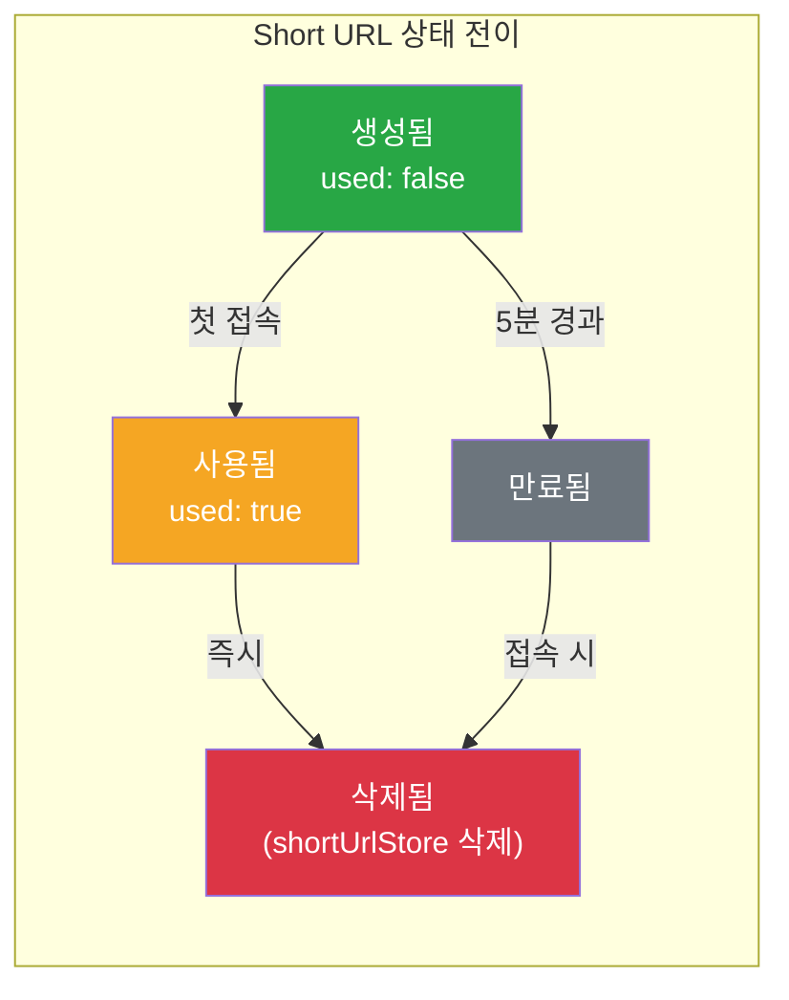
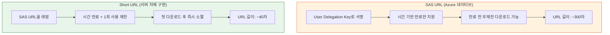

# BlobOneTimeAPI (Node.js)

Databricks SQL 쿼리 결과를 ADLS Gen2 Blob에 저장하고, One-time SAS URL을 생성하는 REST API

## Architecture



## Infrastructure

- **Databricks Workspace**: https://{databricks-host}
- **Blob Storage**: https://{blob-host}.dfs.core.windows.net/
- **Authentication**: Azure Managed Identity
  - Local: VM Managed Identity
  - Production: AKS Workload Identity (UAMI)
  - RBAC: Storage Blob Data Contributor

### Storage Paths

| Environment | Storage Account | Path |
|---|---|---|
| PRD | xxxxxprdex | api/audience/{id}/ |
| STG | xxxxxstgex | api/audience/{id}/ |
| DEV | xxxxxdevex | api/audience/{id}/ |

## Setup

### 1. Install dependencies

```bash
cd NodeJS/BlobOneTimeAPI
npm install
```

### 2. Configure environment variables

```bash
cp .env.example .env
# .env 파일을 열어 DATABRICKS_HTTP_PATH 등을 수정
```

#### Environment Variables

| Variable | Description | Default |
|---|---|---|
| `DATABRICKS_HOST` | Databricks workspace URL | (required) |
| `DATABRICKS_HTTP_PATH` | SQL Warehouse HTTP path | (required) |
| `STORAGE_ACCOUNT` | Azure Storage account name | `{blob-host}` |
| `STORAGE_CONTAINER` | Blob container name | `api` |
| `SAS_EXPIRY_MINUTES` | SAS URL expiry time (minutes) | `5` |
| `PORT` | Server port | `3000` |
| `AUTH_USER` | Test page login username | - |
| `AUTH_PASS` | Test page login password | - |

### 3. Run

```bash
npm start        # production
npm run dev      # development (auto-reload)
```

## API

### POST /api/getOnetimeURL

#### Request

```json
{
    "query": "SELECT C_CUSTKEY, C_NAME, C_ADDRESS, C_NATIONKEY, C_PHONE, C_ACCTBAL, C_MKTSEGMENT, C_COMMENT FROM mskr_databricks.tpch.customer LIMIT 1;",
    "id": "100"
}
```

#### Response

```json
{
    "location": "abfss://api@{blob-host}.dfs.core.windows.net/audience/100/data.csv",
    "one-time-url": "https://{blob-host}.blob.core.windows.net/api/audience/100/data.csv?sv=..."
}
```

#### Error Response

```json
{
    "error": "query and id are required"
}
```

## One-Time URL 상세 설명

### 개요

One-Time URL은 Blob Storage에 저장된 파일을 **1회만 다운로드**할 수 있도록 제한하는 URL입니다. 본 API는 두 가지 계층의 URL을 조합하여 보안성을 확보합니다.

| URL 유형 | 생성 위치 | 만료 조건 | 특징 |
|---|---|---|---|
| **SAS URL** | Azure Blob Storage | 시간 기반 (기본 5분) | User Delegation Key 기반, read-only |
| **Short URL** | Express 서버 (in-memory) | 시간 기반 + **1회 사용** | SAS URL을 래핑, 진정한 one-time |

### URL 생성 및 소멸 흐름



### Short URL 보안 모델



### SAS URL vs Short URL 비교



### useShortUrl 옵션별 동작

| 요청 | 응답 필드 | 다운로드 제한 |
|---|---|---|
| `useShortUrl` 생략 (기본) | `sas-url` + `short-url` | 1회 (Short URL) / 5분 내 무제한 (SAS URL) |
| `"useShortUrl": true` | `sas-url` + `short-url` | 위와 동일 |
| `"useShortUrl": false` | `sas-url`만 | 5분 내 무제한 (SAS URL만) |

### 주의사항

- Short URL은 **서버 인메모리(Map)**에 저장되므로 서버 재시작 시 기존 Short URL이 모두 소멸됨
- SAS URL을 알고 있으면 Short URL과 무관하게 만료 시간 내 접근 가능 (Short URL은 SAS URL의 노출을 줄이는 역할)
- 프로덕션 환경에서 다중 인스턴스 운영 시 Redis 등 외부 저장소로 전환 필요

## Test Page

브라우저에서 `http://localhost:3000/test` 접속 시 Basic Auth 인증 후 React 기반 테스트 UI를 사용할 수 있습니다.

- SQL Query와 ID에 default 값이 세팅되어 있으며 수정 가능
- 실행 결과의 one-time-url 클릭으로 파일 다운로드 확인 가능

## Project Structure

```
NodeJS/BlobOneTimeAPI/
├── package.json
├── .env.example
├── .env                  # (git ignored)
├── .gitignore
├── public/
│   └── index.html        # React test page
├── src/
│   ├── server.js         # Entrypoint
│   ├── app.js            # Express routes + auth middleware
│   ├── config.js         # Environment config
│   ├── databricks.js     # Databricks SQL execution
│   └── blob.js           # Blob upload + SAS URL generation
└── README.md
```

## Blob Lifecycle Management Policy

One-time URL로 생성된 파일은 일정 기간 후 자동 삭제되도록 Azure Blob Storage Lifecycle Management Policy를 설정합니다.

### Azure Portal에서 설정

1. Azure Portal → Storage Account → **Data management** → **Lifecycle management**
2. **+ Add a rule** 클릭
3. 아래와 같이 설정:

| 항목 | 값 |
|---|---|
| Rule name | `delete-audience-after-7days` |
| Rule scope | Limit blobs with filters |
| Blob type | Block blobs |
| Blob subtype | Base blobs |
| Prefix match | `api/audience/` |
| Days after last modification | `7` |
| Action | Delete the blob |

### Azure CLI로 설정

```bash
az storage account management-policy create \
  --account-name <STORAGE_ACCOUNT> \
  --resource-group <RESOURCE_GROUP> \
  --policy @lifecycle-policy.json
```

`lifecycle-policy.json`:

```json
{
  "rules": [
    {
      "enabled": true,
      "name": "delete-audience-after-7days",
      "type": "Lifecycle",
      "definition": {
        "actions": {
          "baseBlob": {
            "delete": {
              "daysAfterModificationGreaterThan": 7
            }
          }
        },
        "filters": {
          "blobTypes": ["blockBlob"],
          "prefixMatch": ["api/audience/"]
        }
      }
    }
  ]
}
```

### Terraform으로 설정

```hcl
resource "azurerm_storage_management_policy" "audience_cleanup" {
  storage_account_id = azurerm_storage_account.this.id

  rule {
    name    = "delete-audience-after-7days"
    enabled = true

    filters {
      prefix_match = ["api/audience/"]
      blob_types   = ["blockBlob"]
    }

    actions {
      base_blob {
        delete_after_days_since_modification_greater_than = 7
      }
    }
  }
}
```

### 참고사항

- Lifecycle policy는 **하루 1회** 실행되므로 정확히 7일이 아닌 7~8일 사이에 삭제될 수 있음
- `api/audience/` prefix에만 적용되므로 다른 컨테이너 데이터에는 영향 없음
- 환경별(PRD/STG/DEV) Storage Account 각각에 동일하게 설정 필요
