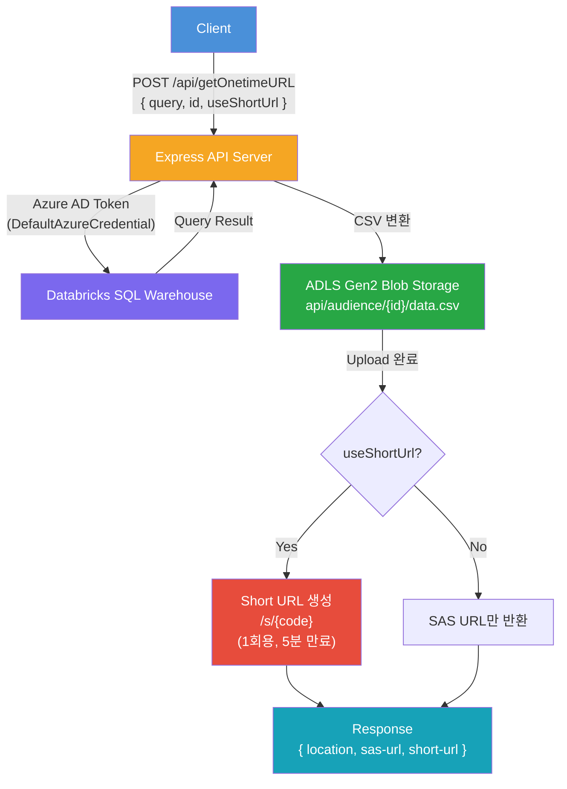

# BlobOneTimeAPI (Node.js)

Databricks SQL 쿼리 결과를 ADLS Gen2 Blob에 저장하고, One-time SAS URL을 생성하는 REST API

## Architecture



## Infrastructure

- **Databricks Workspace**: https://adb-1949729781658890.10.azuredatabricks.net
- **Blob Storage**: https://mskrblobonetime.dfs.core.windows.net/
- **Authentication**: Azure Managed Identity
  - Local: VM Managed Identity
  - Production: AKS Workload Identity (UAMI)
  - RBAC: Storage Blob Data Contributor

### Storage Paths

| Environment | Storage Account | Path |
|---|---|---|
| PRD | stneuprdex | api/audience/{id}/ |
| STG | stneustgex | api/audience/{id}/ |
| DEV | stneudevex | api/audience/{id}/ |

### DW Table

`cat_common_prd.meta.current_dw_user_info`

## Setup

### 1. Install dependencies

```bash
cd NodeJS/BlobOneTimeAPI
npm install
```

### 2. Configure environment variables

```bash
cp .env.example .env
# .env 파일을 열어 DATABRICKS_HTTP_PATH 등을 수정
```

#### Environment Variables

| Variable | Description | Default |
|---|---|---|
| `DATABRICKS_HOST` | Databricks workspace URL | (required) |
| `DATABRICKS_HTTP_PATH` | SQL Warehouse HTTP path | (required) |
| `STORAGE_ACCOUNT` | Azure Storage account name | `mskrblobonetime` |
| `STORAGE_CONTAINER` | Blob container name | `api` |
| `SAS_EXPIRY_MINUTES` | SAS URL expiry time (minutes) | `5` |
| `PORT` | Server port | `3000` |
| `AUTH_USER` | Test page login username | - |
| `AUTH_PASS` | Test page login password | - |

### 3. Run

```bash
npm start        # production
npm run dev      # development (auto-reload)
```

## API

### POST /api/getOnetimeURL

#### Request

```json
{
    "query": "SELECT C_CUSTKEY, C_NAME, C_ADDRESS, C_NATIONKEY, C_PHONE, C_ACCTBAL, C_MKTSEGMENT, C_COMMENT FROM mskr_databricks.tpch.customer LIMIT 1;",
    "id": "100"
}
```

#### Response

```json
{
    "location": "abfss://api@mskrblobonetime.dfs.core.windows.net/audience/100/data.csv",
    "one-time-url": "https://mskrblobonetime.blob.core.windows.net/api/audience/100/data.csv?sv=..."
}
```

#### Error Response

```json
{
    "error": "query and id are required"
}
```

## Test Page

브라우저에서 `http://localhost:3000/test` 접속 시 Basic Auth 인증 후 React 기반 테스트 UI를 사용할 수 있습니다.

- SQL Query와 ID에 default 값이 세팅되어 있으며 수정 가능
- 실행 결과의 one-time-url 클릭으로 파일 다운로드 확인 가능

## Project Structure

```
NodeJS/BlobOneTimeAPI/
├── package.json
├── .env.example
├── .env                  # (git ignored)
├── .gitignore
├── public/
│   └── index.html        # React test page
├── src/
│   ├── server.js         # Entrypoint
│   ├── app.js            # Express routes + auth middleware
│   ├── config.js         # Environment config
│   ├── databricks.js     # Databricks SQL execution
│   └── blob.js           # Blob upload + SAS URL generation
└── README.md
```
